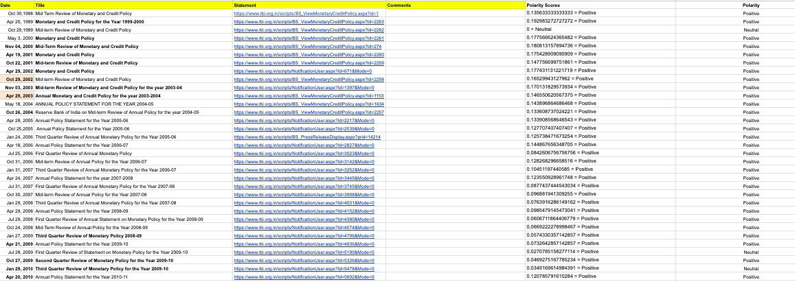

# Semantic Sentiment Analysis of RBI Governor's Speeches

This project aims to perform sentiment analysis on speeches delivered by the Governor of the Reserve Bank of India (RBI) using natural language processing (NLP) techniques.

## Description

The repository contains the code for the following tasks:

* Data preprocessing and cleaning
* Feature extraction
* Training and evaluation of the sentiment analysis model

The data used for this project consists of speeches delivered by the RBI Governor between 2016 and 2021. The text data is preprocessed to remove stop words, punctuation, and other irrelevant information. Then, feature extraction is performed using the bag-of-words model.

The sentiment analysis model is trained on a labeled dataset using a machine learning algorithm. The performance of the model is evaluated using accuracy, precision, recall, and F1-score metrics.

## Results

The results of the sentiment analysis are presented in the following chart:

As you can see, the majority of the speeches have a positive sentiment, while a few have a neutral or negative sentiment.

## Conclusion

In conclusion, this project demonstrates the use of NLP techniques for sentiment analysis on speeches delivered by the RBI Governor. The results show that the sentiment of the speeches is mostly positive, which is not imperative of the real situation. This shows the effect of signal jamming by the governor,as in the they represent the bad news in also a positive way. However, further analysis can be done to identify the reasons for positive or negative sentiments in the speeches.

## Credits

This project was developed by [Ashwin Nair](https://github.com/Ashwin9084).

## License

This project is licensed under the [MIT License](https://opensource.org/licenses/MIT).
